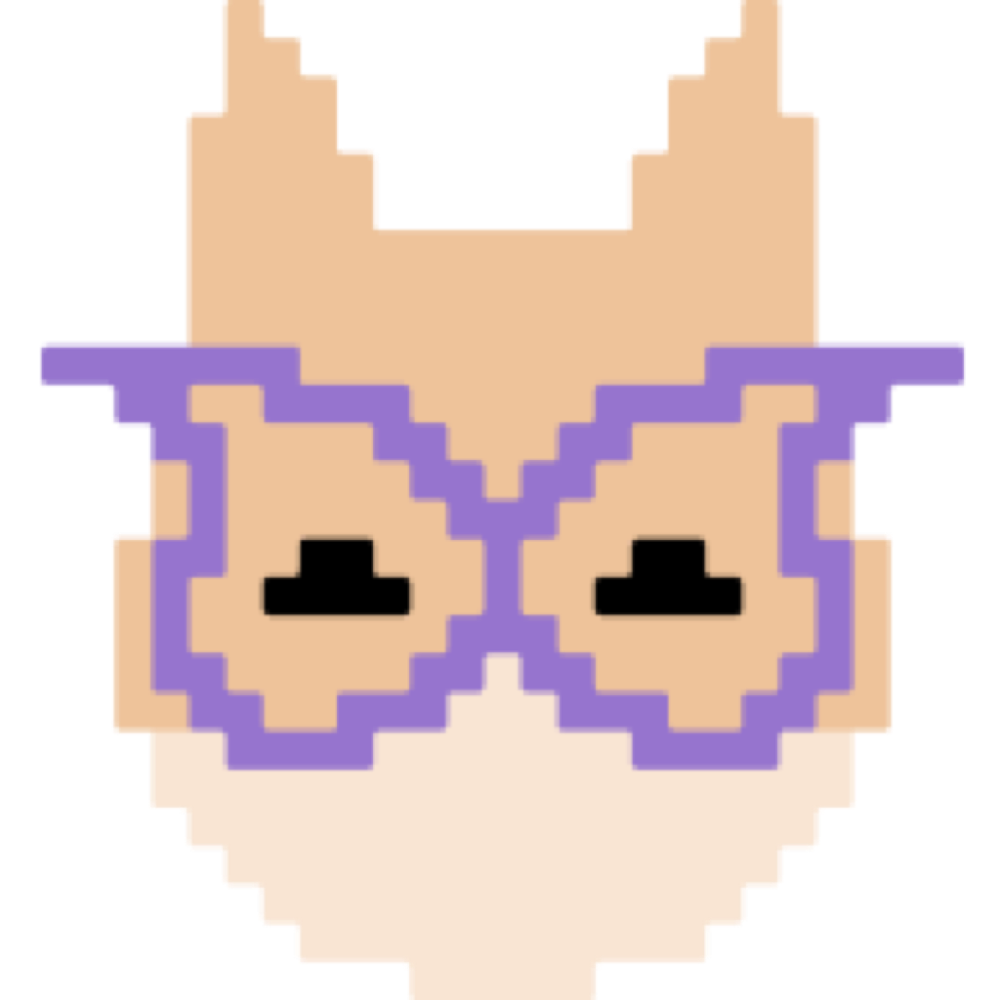

<h1>
  
  Zvycha frontend
</h1>

Zvycha is a habit-building app that combines the body doubling method through shared focus rooms with gamification — supporting your habit formation journey by caring for a virtual Tamagotchi-style pet.

## Table of Contents
- [Key Features](#key-features)
- [Technology Stack](#technology-stack)
- [Demo](#demo)
- [Getting Started for Local Development](#getting-started-for-local-development)
- [Contact](#contact)

### Key Features

- Habit tracker
- User authentication/authorization
- Shared focus rooms
- Social interactions
- Pomodoro timer (not implemented yet)
- Virtual Tamagotchi pet to visualize habit progress
- Pet customization system
- Statistics/dashboard (not implemented yet)

### Technology Stack
<p align="left">


</p>

### Demo
To ask for a live demo, visit [this page](https://zvycha-landing.vercel.app/)


### Getting Started for Local Development
1. Clone the repository:
```bash
git clone https://github.com/AnnKuts/zvycha-frontend.git
cd zvycha-frontend
```
2. Download backend and enter all neccessary .env there
3. Run docker
```bash
docker compose build
docker compose up
```
3. Fill the [.env file](https://github.com/AnnKuts/zvycha-frontend/blob/main/.env.example). Then add your environment variables:
```env
BASE_URL=http://your-backend-api-url.com
```
4. Install dependencies:
```bash
flutter pub get
```
5. Start the development server
```bash
flutter run
```
6. Open emulator

### Contact
If you have questions or suggestions, open an issue or contact the maintainers listed in the repository.  
We welcome your pull requests! Before contributing, please read our [CONTRIBUTING.md](https://github.com/AnnKuts/zvycha-app/blob/main/docs/CONTRIBUTING.md).
